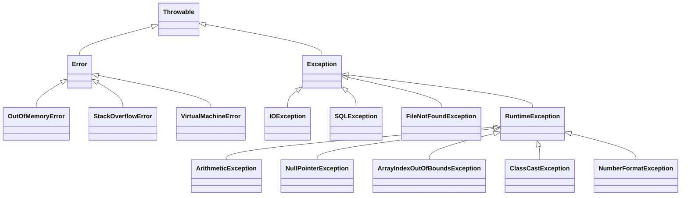

# ⚠️ Errors and Exceptions in Java

Programming in Java (or any language) involves dealing with different kinds of **errors** that occur during development and execution.  
Understanding these errors is key to writing **robust, maintainable, and bug-free** applications.

---

## ⚙️ 1. Types of Errors in Java

### 🧩 1.1 Compilation Errors
- Occur during the **compilation phase**.
- Caused by violating the rules of the Java language (**syntax errors**).
- The compiler detects them **before running the program**.

#### Examples:
- Missing semicolon `;`
- Using an undeclared variable
- Mismatched data types in assignments

```java
int x = "Hello";  // ❌ Compilation Error: incompatible types
````

---

### 🧩 1.2 Runtime Errors

* Happen **while the program is running**.
* Cause the program to terminate abnormally if not handled.
* Typically caused by invalid input, memory issues, or illegal operations.

#### Examples:

* Dividing by zero
* Accessing an invalid array index

```java
int a = 5 / 0;  // ❌ Runtime Error: ArithmeticException
```

---

### 🧩 1.3 Logical Errors

* The program **runs successfully** but produces **incorrect results**.
* Harder to detect since there are no compilation or runtime errors.
* Usually caused by flawed logic or incorrect algorithms.

```java
int marks = 85;
if (marks > 90) 
{
    System.out.println("Passed");  // ❌ Logical Error: wrong condition
}
```

---

## 🧱 2. Exceptions in Java

An **exception** is an event that disrupts the normal flow of program execution.
Java provides a **robust mechanism** for handling exceptions using `try-catch-finally`.

---

### 🏗️ 2.1 Exception Hierarchy



---

### 🔍 2.2 Types of Exceptions

#### 🔹 Checked Exceptions

* Checked at **compile time**.
* Must be handled or declared using `throws`.
* Examples: `IOException`, `SQLException`, `FileNotFoundException`.

```java
import java.io.*;

public class CheckedExample 
{
    public static void main(String[] args) 
    {
        try 
        {
            FileReader fr = new FileReader("data.txt");
        }
        catch (FileNotFoundException e) 
        {
            System.out.println("File not found!");
        }
    }
}
```

---

#### 🔹 Unchecked Exceptions

* Checked at **runtime**, not by the compiler.
* Subclasses of `RuntimeException`.
* Examples: `NullPointerException`, `ArithmeticException`, `ArrayIndexOutOfBoundsException`.

```java
public class UncheckedExample 
{
    public static void main(String[] args) 
    {
        int num = 5 / 0; // ArithmeticException
    }
}
```

---

### 🧩 2.3 Exception Handling Keywords

| Keyword   | Description                               |
|-----------|-------------------------------------------|
| `try`     | Block of code that may throw an exception |
| `catch`   | Handles the exception                     |
| `finally` | Always executes (used for cleanup)        |
| `throw`   | Explicitly throws an exception            |
| `throws`  | Declares exceptions a method can throw    |

```java
public void readFile(String file) throws IOException 
{
    FileReader fr = new FileReader(file);
}
```

---

### 🧠 2.4 Try-With-Resources (Java 8+)

Used for automatic resource management (e.g. closing files, streams).

```java
import java.io.BufferedReader;
import java.io.FileReader;
import java.io.IOException;

public class TryWithResourcesExample 
{
    public static void main(String[] args) 
    {
        try (BufferedReader reader = new BufferedReader(new FileReader("data.txt"))) 
        {
            System.out.println(reader.readLine());
        } 
        catch (IOException e) 
        {
            System.out.println("Error reading file: " + e.getMessage());
        }
    }
}
```

---

### 💡 2.5 Custom Exceptions

Create your own exceptions by extending `Exception` or `RuntimeException`.

```java
class InvalidAgeException extends Exception 
{
    public InvalidAgeException(String message) 
    {
        super(message);
    }
}

public class CustomExceptionDemo 
{
    static void checkAge(int age) throws InvalidAgeException 
    {
        if (age < 18) 
        {
            throw new InvalidAgeException("Age must be 18 or above!");
        }
    }

    public static void main(String[] args) 
    {
        try 
        {
            checkAge(16);
        } 
        catch (InvalidAgeException e) 
        {
            System.out.println("Caught Exception: " + e.getMessage());
        }
    }
}
```

---

### 🧭 2.6 Best Practices for Exception Handling

* ✅ Use **specific exception types** instead of generic `Exception`.
* 🚫 Avoid empty `catch` blocks.
* ♻️ Use `finally` or **try-with-resources** for cleanup.
* ⚙️ Don’t use exceptions for normal control flow.
* 🧩 Create **custom exceptions** for meaningful error messages.
* 🪵 Always **log exceptions** for debugging.

---

## 🧮 3. Common Exceptions in Java

| Exception                         | Description                |
|-----------------------------------|----------------------------|
| `ArithmeticException`             | Division by zero           |
| `NullPointerException`            | Accessing a null object    |
| `ArrayIndexOutOfBoundsException`  | Invalid array index        |
| `StringIndexOutOfBoundsException` | Invalid string index       |
| `ClassCastException`              | Invalid type casting       |
| `NumberFormatException`           | Invalid number conversion  |
| `IllegalArgumentException`        | Invalid method argument    |
| `IllegalStateException`           | Invalid method call timing |
| `IOException`                     | Input/output failure       |
| `FileNotFoundException`           | File not found             |
| `SQLException`                    | Database error             |
| `InterruptedException`            | Thread interrupted         |
| `UnsupportedOperationException`   | Operation not supported    |

---

## 🧾 Summary

| Error Type            | When It Occurs | Description                             |
|-----------------------|----------------|-----------------------------------------|
| **Compilation Error** | Compile-time   | Syntax violation                        |
| **Runtime Error**     | Execution      | Unchecked exception                     |
| **Logical Error**     | Execution      | Incorrect result due to bad logic       |
| **Exception**         | Execution      | Java mechanism to handle runtime issues |

---

## 🎯 Learning Outcomes

By the end of this module, you will be able to:

* ✅ Identify **compilation**, **runtime**, and **logical** errors.
* ✅ Explain Java’s **exception hierarchy** (`Throwable`, `Error`, `Exception`).
* ✅ Use `try`, `catch`, `finally`, `throw`, and `throws` effectively.
* ✅ Write and use **custom exceptions**.
* ✅ Apply **best practices** for safe, readable, and maintainable error handling.
* ✅ Use **try-with-resources** for modern resource management.

---

